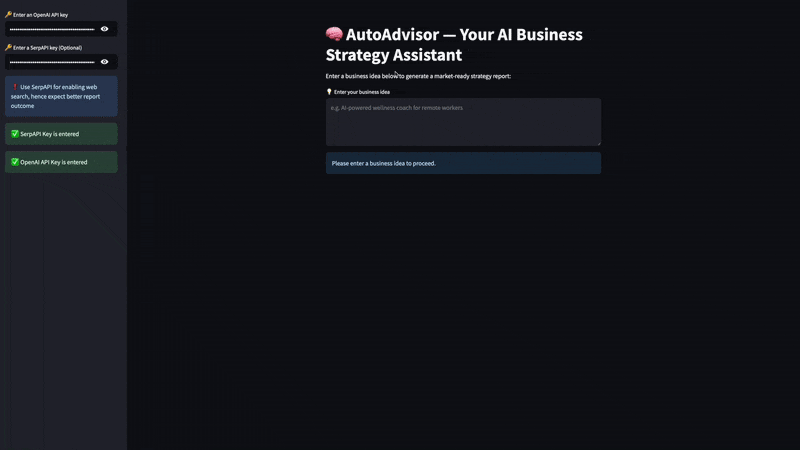

# 🧠 AutoAdvisor – AI-Powered Business Strategy Assistant

AutoAdvisor is an AI-powered business strategy assistant that helps users transform raw business ideas into validated, actionable strategies using advanced language models and autonomous AI agents. It validates ideas, rephrases vague inputs, performs strategic analysis, and delivers a detailed final report including a SWOT analysis.


---

## 🚀 Features

- ✅ **LLM Validation:** Checks if the input is a valid business idea.
- ♻️ **Auto-Correction:** Rephrases unclear or vague ideas into proper business concepts.
- 🧠 **CrewAI Agent Workflow:** Uses specialized AI agents to analyze ideas and generate strategic insights.
- 📊 **SWOT Analysis:** Includes strengths, weaknesses, opportunities, and threats.
- 📄 **PDF Export:** Unicode-compatible PDF generation for offline viewing.
- 🌐 **Streamlit Web Interface:** Easy-to-use web app for business users and entrepreneurs.

## 🖥️ Live App

Coming soon!

## 🧩 Tech Stack

- [Python](https://www.python.org/)
- [Streamlit](https://streamlit.io/)
- [LangChain](https://www.langchain.com/)
- [OpenAI](https://platform.openai.com/)
- [CrewAI](https://github.com/joaomdmoura/crewAI)

## 🧪 How It Works

1. User enters a business idea.
2. LLM checks if it's valid.
3. If invalid, AutoAdvisor tries to rephrase it.
4. A team of AI agents performs market, product, and SWOT analysis.
5. A detailed report is generated and offered as downloadable PDF.

## 🎥 Example Demo



<figure class="video_container">
  <iframe src="./assets/demo.mp4" frameborder="0" allowfullscreen="true"> 
</iframe>
</figure>

## 📂 Installation

1. Clone the repository:

   ```bash
   git clone https://github.com/davutbayik/auto-advisor-ai
   cd auto-advisor-ai

2. Create and activate a virtual environment (Optional-Recommended):

   ```bash
   python -m venv .venv
   source .venv/bin/activate  # On Windows: .venv\Scripts\activate

3. Install the required packages:
   ```bash
   pip install -r requirements.txt

4. Run Streamlit app:
   ```bash
   streamlit run main.py

## 🔑 Environment Variables

Create a `.env` file in the root directory with:

```
OPENAI_API_KEY=your_openai_key
```

## 📄 License

This project is licensed under the terms of the [MIT License](LICENSE).  
You are free to use, modify, and distribute this software as long as you include the original license.

## 📬 Contact

Made with ❤️ by [Davut Bayık](https://github.com/davutbayik) — feel free to reach out via GitHub for questions, feedback, or collaboration ideas.

---

⭐ If you found this project helpful, consider giving it a star!
